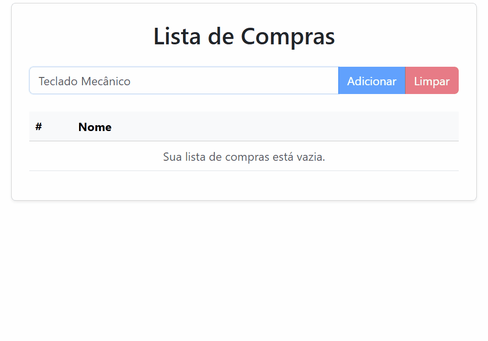

# Lista de Compras

Esta é uma aplicação de gerenciamento de itens desenvolvida para consolidar os fundamentos do **Angular 19**. O foco do projeto foi aplicar na prática o controle de estado de listas, manipulação de arrays no TypeScript e a utilização da nova sintaxe de controle de fluxo do Angular.

## Demonstração

A aplicação permite adicionar itens com limite de caracteres, marcar itens como comprados (com efeito visual), remover itens individualmente e limpar a lista completa.

<p align="center">
  
</p>

Acesse a aplicação online: [Lista de Compras Angular](https://josecampelo.github.io/lista-compras-angular/).

## Tecnologias e Ferramentas

* **Angular 19**: Desenvolvimento utilizando o padrão de *Standalone Components*.
* **Bootstrap 5**: Estilização de componentes (Cards, Tables, Inputs) e layout responsivo.
* **Bootstrap Icons**: Utilização de ícones vetoriais para ações de interface.
* **TypeScript**: Uso de **Interfaces** para modelagem de dados e tipagem forte.
* **Git & Conventional Commits**: Padronização de mensagens de commit (`feat`, `fix`, `build`).

## Conceitos Praticados

* **Interfaces**: Criação de modelos de dados robustos com propriedades obrigatórias e opcionais.
* **Nova Sintaxe de Controle (`@for` e `@empty`)**: Renderização dinâmica de listas e tratamento de estados vazios.
* **Two-Way Data Binding (`[(ngModel)]`)**: Sincronização em tempo real de inputs e estados de checkboxes.
* **Class Binding**: Aplicação dinâmica de classes CSS (ex: riscar texto de itens comprados).
* **Manipulação de Arrays**: Uso de métodos modernos como `.filter()` para remoção de registros.
* **Lógica de Identificadores**: Implementação de contador global para garantir IDs únicos e evitar duplicidade.

## Como rodar o projeto localmente

Para executar este projeto em sua máquina, você precisará ter o [Node.js](https://nodejs.org/) e o [Angular CLI](https://angular.io/cli) instalados.

1.  **Clone este repositório**:
    ```bash
    git clone https://github.com/josecampelo/lista-compras-angular.git
    ```
2.  **Acesse a pasta do projeto**:
    ```bash
    cd lista-compras-angular
    ```
3.  **Instale as dependências**:
    ```bash
    npm install
    ```
4.  **Inicie o servidor de desenvolvimento**:
    ```bash
    ng serve
    ```
5.  Abra o seu navegador no endereço: `http://localhost:4200/`.
